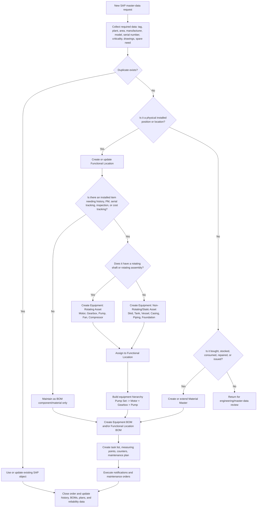
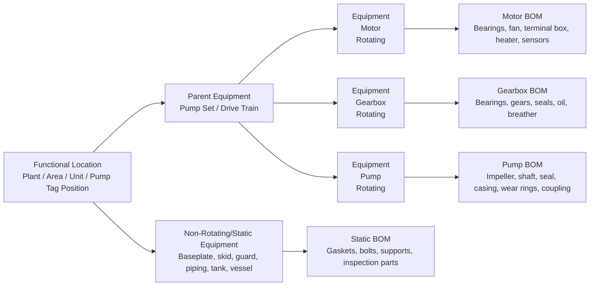

# SAP Process: Motors, Gearboxes, Pumps, Rotating/Non-Rotating Equipment and Materials

Created: 2026-07-08

## Purpose

This document defines a practical SAP master-data and maintenance process for motors, gearboxes, pumps, rotating equipment, non-rotating/static equipment, and related materials/spares.

Use it to decide whether an item should be created as:

- a Functional Location, meaning the physical place or system where equipment is installed;
- an Equipment master record, meaning a maintainable and traceable asset;
- a Material master record, meaning a stock, non-stock, spare, consumable, or repairable item;
- an Equipment/Functional Location BOM component, meaning a spare or component linked to an asset structure.

## Scope

Included:

- Motors
- Gearboxes
- Pumps
- Pump sets or drive trains
- Rotating spare parts, such as bearings, shafts, couplings, impellers, seal assemblies, rotors
- Non-rotating/static items, such as baseplates, skids, casings, tanks, frames, guards, piping spools, foundations, structural supports
- Consumables and MRO materials, such as lubricant, grease, gasket kits, fasteners, filters

Excluded unless locally required:

- Finance asset capitalization rules
- Engineering document management configuration
- SAP custom field configuration
- SAP role authorization design

## Core Rule

Create an SAP Equipment record when the item is installed, maintainable, traceable, and needs maintenance history, cost history, inspection records, serialization, or reliability analysis.

Create an SAP Material record when the item is bought, stored, consumed, repaired, stocked, issued, or used as a spare.

Create both when a physical item starts as a stocked spare material and later becomes an installed, maintainable asset. Example: a spare motor is received as a serialized material in the warehouse; when installed, it is linked or represented as an equipment record so maintenance history can be captured.

## Recommended SAP Object Model

| Object | SAP use | Typical examples | Create when |
|---|---|---|---|
| Functional Location | Location, system, line, unit, train, or technical position | Plant > Area > Unit > Pump Station > Pump Tag | The item represents where equipment is installed or where maintenance is performed |
| Equipment | Maintainable physical asset | Motor, gearbox, pump, pump set, pressure vessel, tank, critical skid | Maintenance history, cost history, inspections, serial tracking, criticality, or PM plans are required |
| Material | Stocked or procured item | Spare motor, bearing, coupling, seal kit, lubricant, gasket, filter | The item is bought, stocked, issued, consumed, repaired, or replenished |
| Equipment BOM | Spare-parts structure for a specific equipment item | Pump BOM: impeller, shaft, seals, bearings, wear rings | Spares must be visible from the asset record or maintenance order |
| Functional Location BOM | Spare-parts structure for a location/system | Pump station common spares | Spares apply to the whole location or system rather than one equipment record |
| Task List | Standard maintenance work steps | Motor inspection, pump overhaul, gearbox oil change | Work instructions are repeatable |
| Maintenance Plan | Preventive maintenance schedule | Monthly inspection, 6-month oil sampling, annual overhaul | Work must be generated on time or counter readings |

## Classification Logic

| Item type | Rotating? | SAP master-data recommendation | Notes |
|---|---:|---|---|
| Installed motor | Yes | Equipment | Create as separate equipment if it has serial number, PM plan, vibration checks, insulation tests, bearing history, or repair history |
| Spare motor in warehouse | Yes | Material, serialized if required | Convert/link to equipment at installation if history must follow the item |
| Installed gearbox | Yes | Equipment | Track ratio, oil type, lubrication plan, vibration, temperature, overhaul history |
| Spare gearbox in warehouse | Yes | Material, serialized if required | Use repairable spare process where applicable |
| Installed pump | Yes | Equipment | Track pump type, service, seal plan, bearing plan, curves/documents, vibration and flow data |
| Pump casing/baseplate/skid | No | Equipment only if inspection/history is required; otherwise BOM material | Static items can still be equipment when inspections, cost tracking, or regulatory records are needed |
| Tank, vessel, piping spool | No | Equipment if inspection/regulatory maintenance is required | Usually managed as static equipment under a functional location |
| Bearing, seal kit, impeller, shaft, coupling | Usually part of rotating asset | Material and BOM component | Equipment only if high-value repairable/serialized and history is required |
| Lubricant, grease, gasket, fastener, filter | No | Material/consumable | Normally not equipment |

## End-to-End SAP Process

1. **Request and intake**
   - Maintenance, engineering, warehouse, or project team raises a master-data request.
   - Required request data: tag number, description, plant, area, manufacturer, model, serial number if available, criticality, drawings/documents, spare requirement, and installation location.

2. **Duplicate check**
   - Search existing Functional Locations, Equipment records, Material records, and BOMs.
   - Do not create duplicates for the same tag, serial number, manufacturer part number, or material number.

3. **Object decision**
   - Decide whether the item is a Functional Location, Equipment, Material, BOM component, or a combination.
   - Use the decision tree in the drawing below.

4. **Create or update Functional Location**
   - Build or confirm the location hierarchy: Plant > Area > Unit > System > Tag position.
   - Assign planner group, maintenance plant, work center, cost center, ABC/criticality, and responsible discipline.

5. **Create Equipment for maintainable assets**
   - Create equipment for motors, gearboxes, pumps, pump sets, and static items that need history.
   - Assign the equipment to the correct Functional Location.
   - Populate manufacturer, model, serial number, technical ID/tag, object type, class, criticality, maintenance plant, planner group, work center, startup date, and warranty if applicable.

6. **Build equipment hierarchy**
   - Recommended hierarchy for a drive train:
     - Functional Location: Pump station or process tag position
     - Parent Equipment: Pump Set or Drive Train
     - Child Equipment: Motor
     - Child Equipment: Gearbox, if installed
     - Child Equipment: Pump
   - If the site does not use parent equipment, assign motor, gearbox, and pump directly to the Functional Location and connect them through BOMs/documents.

7. **Create/extend Material records**
   - Create material masters for spares, repairables, consumables, and stocked assemblies.
   - Include base unit of measure, MRP type, valuation class, purchasing data, manufacturer part number, storage location, serial profile if needed, batch requirements if needed, and safety stock/reorder point if used.

8. **Create BOMs**
   - Create Equipment BOMs for asset-specific spares.
   - Create Functional Location BOMs for common location/system spares.
   - Include critical spares: bearings, seals, impellers, shafts, couplings, gaskets, fasteners, filters, lubricant, guards, sensors, and repair kits.

9. **Create maintenance strategy**
   - Create task lists for standard inspections, lubrication, vibration routes, oil analysis, alignment checks, overhaul steps, and statutory inspections.
   - Create maintenance plans based on time, counter, or condition as applicable.
   - Create measuring points/counters for running hours, starts, vibration, temperature, pressure, flow, oil condition, and energy consumption where useful.

10. **Execute maintenance**
    - Create notifications for failures, defects, or work requests.
    - Create maintenance orders for planned or corrective work.
    - Issue materials from the BOM or material master.
    - Confirm labor, failure codes, causes, activities, parts consumed, and measurement readings.

11. **Close-out and continuous improvement**
    - Verify the equipment history and cost capture.
    - Update BOMs when new spares are identified.
    - Update task lists and maintenance plans based on failures, inspections, and reliability findings.
    - Review duplicates and obsolete materials periodically.

## Process Drawing

## Equipment Hierarchy Drawing

## Minimum Data Standards

### Functional Location

- Functional location ID/tag
- Description using site naming convention
- Plant and maintenance plant
- Area/unit/system
- Main work center
- Planner group
- Cost center or settlement receiver
- Criticality or ABC indicator
- Location/system status

### Equipment: motor

- Tag/technical ID
- Equipment description
- Manufacturer, model, serial number
- Power rating, voltage, current, frequency, speed, frame size, enclosure, insulation class, protection class
- Bearing type, lubrication type, lubricant, grease quantity, relubrication interval
- Coupling type and alignment requirements
- Criticality, work center, maintenance strategy
- Measuring points: running hours, starts, vibration, temperature, insulation resistance if used

### Equipment: gearbox

- Tag/technical ID
- Manufacturer, model, serial number
- Gear ratio, input/output speed, power/torque rating, service factor
- Lubricant type, oil quantity, breather type, seal type
- Coupling details
- Measuring points: vibration, temperature, oil condition, running hours

### Equipment: pump

- Tag/technical ID
- Manufacturer, model, serial number
- Pump type, service/fluid, capacity, head, speed, seal type, bearing type
- Motor/gearbox relationship
- Criticality, operating duty, spare strategy
- Measuring points: flow, suction/discharge pressure, vibration, temperature, running hours

### Material master

- Material description using naming standard
- Material type: spare, consumable, repairable, non-stock, or site-specific equivalent
- Base unit of measure
- Manufacturer and manufacturer part number
- Purchasing group and purchasing text
- Valuation class and price control as locally configured
- MRP type, reorder point, safety stock, lead time if stocked
- Storage location and bin if used
- Serial number profile if serialized
- Batch management if required
- Link to equipment BOM or functional location BOM

## Suggested Naming Standards

| Object | Naming pattern | Example |
|---|---|---|
| Motor equipment | MOTOR - tag - power - speed | MOTOR - P-101A - 75 kW - 1500 rpm |
| Gearbox equipment | GEARBOX - tag - ratio | GEARBOX - P-101A - 4.2:1 |
| Pump equipment | PUMP - tag - service | PUMP - P-101A - Cooling Water |
| Spare material | noun, key attribute, size/rating, manufacturer part number | BEARING, DEEP GROOVE, 6312, SKF |
| Seal kit | noun, equipment model, material, manufacturer part number | SEAL KIT, PUMP ABC-100, VITON, OEM12345 |

## Governance and Approvals

| Step | Owner | Approver |
|---|---|---|
| Request creation | Maintenance/engineering/warehouse | Requester's supervisor if required |
| Technical validation | Reliability or maintenance engineer | Maintenance manager |
| Material validation | MRO/material planner | Supply chain or warehouse lead |
| SAP creation/update | Master-data steward | Master-data owner |
| PM plan/task list validation | Reliability/maintenance engineer | Maintenance manager |
| Final release | Master-data steward | Asset owner |

## Quality Checks Before Release

- No duplicate equipment, material, or BOM records exist.
- Equipment is assigned to the correct Functional Location.
- Material descriptions follow the naming standard.
- Manufacturer, model, serial number, and part numbers are populated where known.
- Criticality is assigned.
- BOMs contain maintainable and stock-relevant spares.
- Task list and maintenance plan exist for critical rotating equipment.
- Measuring points are created where condition monitoring or counters are required.
- Drawings, manuals, certificates, and data sheets are linked where document management is used.
- The object status is released for maintenance use.

## Example: Pump Set P-101A

| SAP object | Example |
|---|---|
| Functional Location | PLANT-AREA-UNIT-P101A |
| Parent Equipment | PUMP SET - P-101A |
| Child Equipment 1 | MOTOR - P-101A - 75 kW |
| Child Equipment 2 | GEARBOX - P-101A - 4.2:1, if installed |
| Child Equipment 3 | PUMP - P-101A - Cooling Water |
| Equipment BOM items | Mechanical seal, bearings, coupling insert, impeller, casing gasket, wear rings, oil, bolts |
| Maintenance plan | Monthly inspection, quarterly vibration, six-month oil check, annual alignment/overhaul review |
| Common measurements | Running hours, vibration, bearing temperature, suction/discharge pressure, flow |

## Notes for Implementation

- SAP transaction codes vary by SAP version and site configuration. Common classic transactions include IL01/IL02 for Functional Locations, IE01/IE02 for Equipment, MM01/MM02 for Materials, IB01 for Equipment BOMs, IB11 for Functional Location BOMs, IA01/IA05 for Task Lists, IP41/IP42 for Maintenance Plans, IW21 for Notifications, and IW31 for Maintenance Orders. Use equivalent Fiori apps where applicable.
- Keep rotating assets separate when the motor, gearbox, and pump are replaced independently, have separate serial numbers, or require separate reliability tracking.
- Keep a component as material/BOM-only when it is low value, not serialized, not independently maintained, and does not require history.
- Treat non-rotating/static equipment as equipment when inspection, statutory compliance, risk, cost history, or repair history must be controlled.
